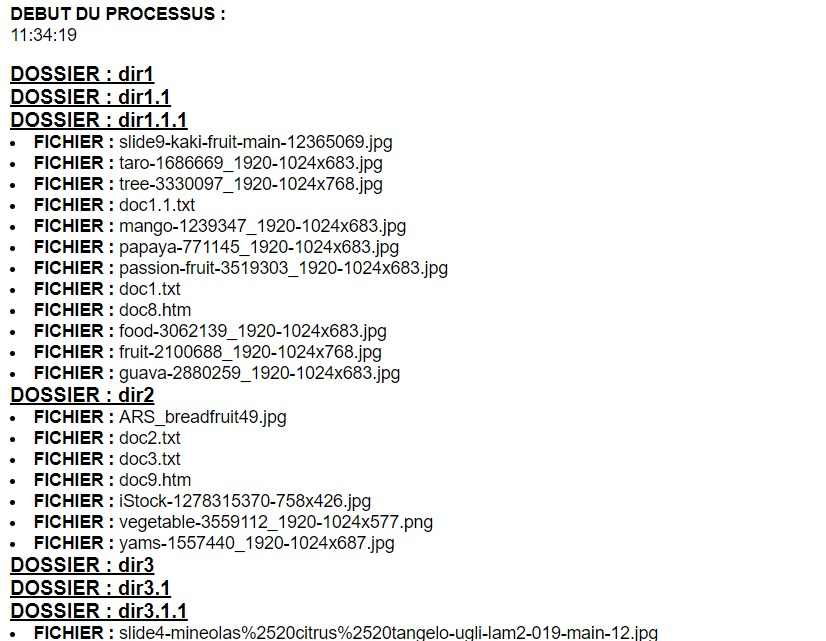

# Lecture récursive du contenu d'un dossier

Dans se script on parcours le répertoire 'docs' et on affiche son contenu : les sous-dossiers et les fichiers qu'il contient.

## Processus de lecture

En premier lieu, on ouvre le répertoire'docs' à l'aide de la fonction 'opendir'.
En second lieu, on lit chaque entrée du dossier (soit fichier ou dossier).
On vérifie d'abord si le nom de l'entrée n'indique pas le chemin du dossier courant ou celui du précédent, ensuite on véirifie, à l'aide de la fonction 'is_dir' si l'entrée est un dossier ou un fichier.

### Un dossier en entrée

Si l'entrée est un dossier on affiche son chemin et on appelle la fonction 'explorerDir' pour parcourir ce sous-dossier.

### Un fichier en entrée

Si l'entrée est un fichier on affiche son chemin, on récupère ses informations et on vérifie s'il s'agit d'une image. Si c'est le cas, on insère les informations dans la base de données.

